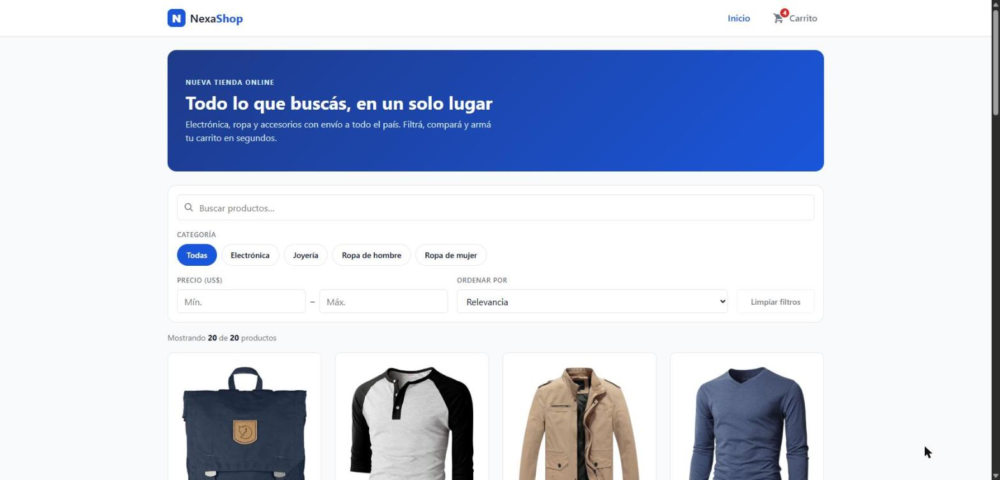
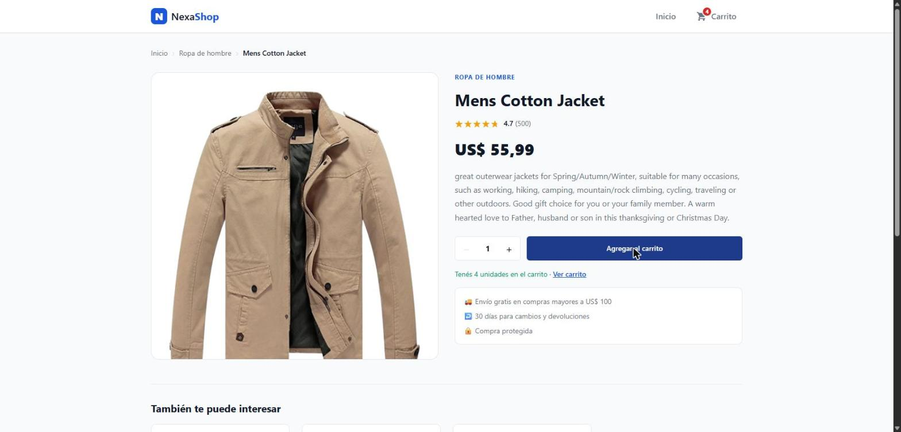
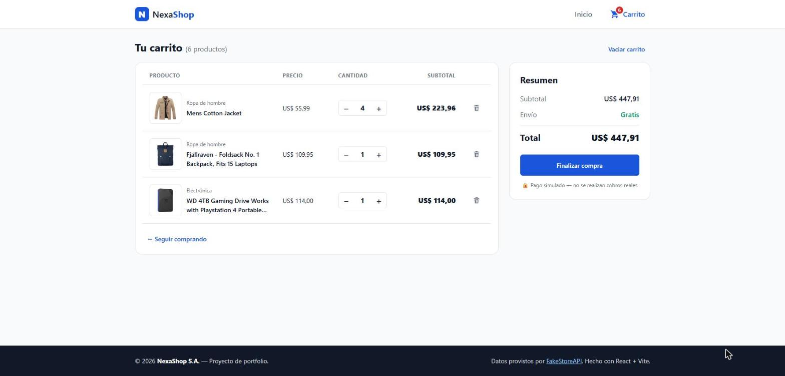
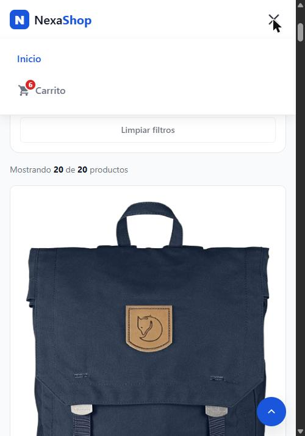
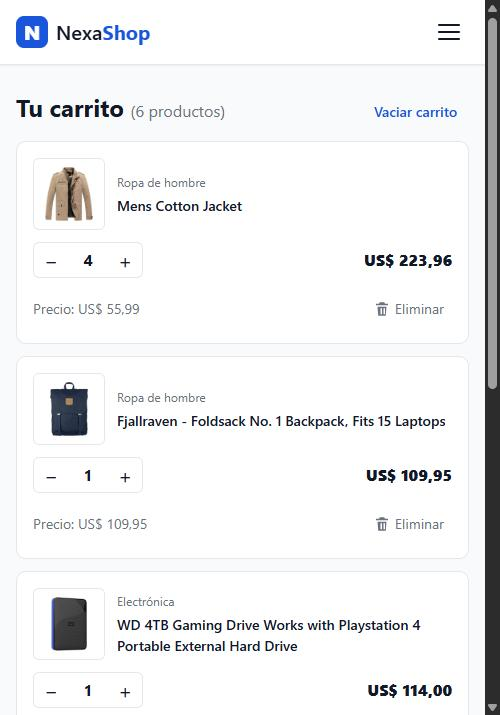
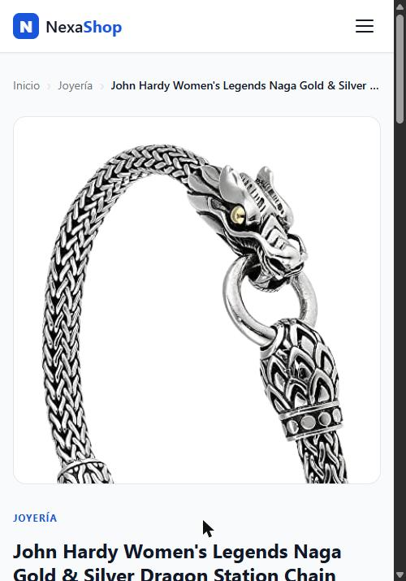

# 🛍️ NexaShop — E-commerce SPA con React

Tienda online construida como **Single Page Application** para **NexaShop S.A.**, una empresa de retail sin presencia digital. Consume datos reales de [FakeStoreAPI](https://fakestoreapi.com), maneja el carrito como estado global con **Context API + useReducer** y lo persiste en **localStorage**. Diseño **mobile-first** y totalmente responsive.

🔗 **Demo en vivo:** https://ujeisson-alt.github.io/nexashop/
📂 **Repositorio:** https://github.com/ujeisson-alt/nexashop



---

## ✨ Funcionalidades

| Módulo | Qué hace |
|---|---|
| **Catálogo** | Grilla de productos desde FakeStoreAPI con _skeleton loader_ mientras carga y estado de error con botón “Reintentar”. |
| **Filtros combinables** | Búsqueda de texto en tiempo real (case-insensitive), categoría (chips), rango de precio mín./máx. y orden (precio / puntuación). Contador “Mostrando X de Y productos”, botón “Limpiar filtros” y estado vacío. |
| **Detalle de producto** | Ruta `/producto/:id`, breadcrumb _Inicio › Categoría › Producto_, imagen con zoom, rating con estrellas, selector de cantidad (mín. 1), productos relacionados (hasta 4) y título dinámico de la pestaña. |
| **Carrito (Context API)** | Agregar, sumar/restar (al llegar a 0 se elimina), eliminar, vaciar, subtotal/envío/total en tiempo real y contador animado en el Navbar. |
| **Persistencia** | El carrito sobrevive a recargas (F5) y al cierre de la pestaña gracias a `localStorage`. |
| **Checkout simulado** | Modal de confirmación → vacía el carrito → redirige al Home con mensaje de éxito. |
| **Responsive** | Grilla 1 / 2 / 3 / 4 columnas, menú hamburguesa en mobile, carrito en tarjetas (mobile) o tabla (desktop), detalle en 1 o 2 columnas. |
| **UX y accesibilidad** | Transiciones en cards, `loading="lazy"` en imágenes, botón “Volver arriba”, `aria-label` en botones de ícono, textos `alt`, foco visible y soporte de `prefers-reduced-motion`. |

## 🧰 Tecnologías

- **React 19** + **Vite** — UI y build ultrarrápido
- **React Router DOM** — navegación SPA (`/`, `/producto/:id`, `/carrito`, 404)
- **Context API + useReducer** — estado global del carrito
- **Custom hooks** — `useProducts`, `useProduct`, `useCategories`, `useRelatedProducts`, `useDocumentTitle`
- **CSS3** — variables CSS, Flexbox, CSS Grid, mobile-first (sin librerías de UI)
- **FakeStoreAPI** — API REST pública de productos
- **GitHub Actions + GitHub Pages** — deploy continuo en cada push a `main` (también listo para Vercel)

## 🗂️ Estructura del proyecto

```
src/
├── components/          ← piezas reutilizables
│   ├── CartItem/        ├── ConfirmModal/     ├── Filters/
│   ├── Footer/          ├── Navbar/ (+CartIcon)├── ProductCard/
│   ├── ProductList/     ├── RelatedProducts/  ├── ScrollToTopButton/
│   ├── SkeletonCard/    └── StarRating/
├── pages/               ← pantallas completas
│   ├── Home.jsx   ├── ProductDetail.jsx   ├── CartPage.jsx   └── NotFound.jsx
├── context/CartContext.jsx   ← estado global (reducer + localStorage)
├── hooks/                    ← lógica reutilizable (fetch, título)
├── services/api.js           ← única capa que habla con la API (con caché)
└── utils/format.js           ← formato de precios y nombres de categorías
```

### Árbol de componentes

```
App
├── CartProvider (envuelve toda la app — en main.jsx)
├── Navbar
│   └── CartIcon (contador)
├── Routes
│   ├── Home ─ Filters, ProductList → ProductCard
│   ├── ProductDetail ─ StarRating, RelatedProducts
│   └── CartPage ─ CartItem, ConfirmModal
└── Footer
```

## 🚀 Cómo correrlo localmente

Requisitos: **Node.js 20+**

```bash
git clone https://github.com/ujeisson-alt/nexashop.git
cd nexashop
npm install
npm run dev        # http://localhost:5173
```

Otros scripts:

```bash
npm run build      # build de producción en /dist
npm run preview    # sirve el build localmente
npm run lint       # análisis estático con oxlint
```

## ☁️ Deploy

**GitHub Pages (actual):** cada push a `main` ejecuta `.github/workflows/deploy.yml`, que compila con `base: '/nexashop/'` y publica `dist/`. Se copia `index.html` como `404.html` para que las rutas de React Router (ej. `/nexashop/carrito`) funcionen al recargar.

**Vercel (alternativa):** importar el repo en [vercel.com](https://vercel.com) → framework **Vite** → Deploy. El `vercel.json` ya incluye el _rewrite_ para las rutas de la SPA.

## 📸 Capturas

| Detalle (desktop) | Carrito (desktop) |
|---|---|
|  |  |

| Menú mobile | Carrito mobile | Detalle mobile |
|---|---|---|
|  |  |  |


## 🧠 Decisiones técnicas

- **`useReducer` en el carrito**: todas las operaciones (`ADD_ITEM`, `REMOVE_ITEM`, `UPDATE_QUANTITY`, `CLEAR_CART`) pasan por una única función pura, fácil de testear y depurar.
- **Lazy initializer** para leer `localStorage` una sola vez al montar, y un `useEffect` que guarda en cada cambio (con `try/catch` para modo incógnito).
- **`useMemo`** en el filtrado para no recalcular en cada render; **`React.memo`** en `ProductCard` y `CartItem`.
- **Categoría en la URL** (`/?categoria=jewelery`): se puede compartir el link y el breadcrumb del detalle vuelve a la categoría filtrada.
- **Caché en `services/api.js`**: volver del detalle al Home no repite el pedido a la API.
- **`key={id}` en el detalle**: al navegar entre productos relacionados el estado local (cantidad) se reinicia sin efectos extra.

## 🔭 Próximos pasos

- Tests automatizados con Vitest + React Testing Library
- Paginación o scroll infinito
- Lista de favoritos
- Checkout real con MercadoPago (requiere backend)

## 👤 Autor

**Jeisson Uribe** — [LinkedIn](https://linkedin.com/in/jeisson-uribe-qa-data) · [GitHub](https://github.com/ujeisson-alt)
